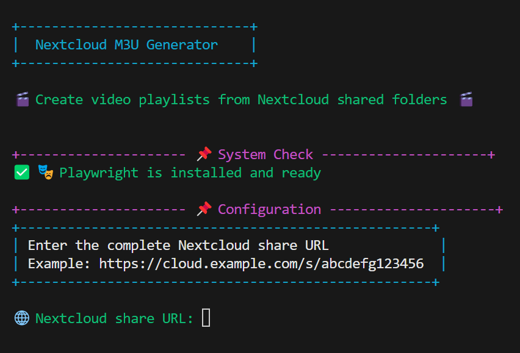

# 🎬 Nextcloud M3U Generator

A Python tool to easily create video playlists from Nextcloud shared links.

[](https://www.python.org/)
[](LICENSE)

## 📋 Table of Contents
- [Overview](#overview)
- [Features](#features)
- [Installation](#installation)
- [Usage](#usage)
- [Troubleshooting](#troubleshooting)
- [Contributing](#contributing)
- [License](#license)

## 📊 Overview

This tool enables you to automatically create M3U playlists from Nextcloud shared links. It scans the content of a Nextcloud share for video files and creates an M3U file with direct links that can be played in VLC or other media players.



## ✨ Features

- 🎨 Interactive, colorful terminal user interface
- 🌐 Automatic extraction of video files from Nextcloud shares
- 🎬 Support for common video formats (MKV, MP4, AVI, etc.)
- 🔄 Automatic detection of Nextcloud URL structure
- 📝 Creation of M3U playlists with direct download links
- 📁 Optional path filtering for specific subfolders
- 🔍 Debug mode for troubleshooting
- ⚙️ Manual file input option (if automatic detection fails)

## 🚀 Installation

### Prerequisites

- Python 3.6 or higher
- pip (Python Package Installer)

### Installing Dependencies

```bash
# Clone the repository
git clone https://github.com/UntoastedToast/Nextcloud-M3U-Generator.git
cd nextcloud-m3u-generator

# Install required packages
pip install -r requirements.txt
```

## 📝 Usage

### Quick Start

```bash
python nextcloud_m3u_generator.py
```

### Step-by-Step Guide

1. Run the script and follow the on-screen instructions
2. Enter the complete Nextcloud share link (e.g., `https://cloud.example.com/s/abcdefg123456`)
3. Optional: Provide a subpath if you only want to use files from a specific folder in the share
4. Choose whether to automatically fetch HTML content (recommended) or input it manually
5. Review the detected video files and adjust the list if needed
6. Enter a name for the playlist file
7. Done! The M3U playlist will be created in the current directory

### Using the Playlist in VLC

1. Open VLC Media Player
2. Open the created .m3u file (File → Open)
3. If asked for credentials:
   - Username: The share token (displayed automatically)
   - Password: The password for the share (if any)
4. Optional: Save the credentials in VLC under Tools → Preferences → Input/Codecs

## ⚠️ Troubleshooting

- **Issue**: No video files found
  - **Solution**: Use the manual file entry option or check the debug HTML file in the `debug_files` folder

- **Issue**: Playwright is not installed
  - **Solution**: If automatic installation fails, install Playwright manually:
    ```bash
    pip install playwright
    python -m playwright install
    ```
    - For Linux users, you might need to install additional system dependencies:
      ```bash
      sudo apt update
      sudo apt install -y libgbm-dev libasound2 libnspr4 libnss3
      ```
    - For more information, see [Playwright's installation guide](https://playwright.dev/docs/intro)

- **Issue**: VLC keeps asking for credentials
  - **Solution**: Save the credentials in VLC under Tools → Preferences → Input/Codecs → Save credentials

## 👨‍💻 Contributing

Contributions are welcome! You can:

1. Fork this repository
2. Create a feature branch (`git checkout -b feature/AmazingFeature`)
3. Commit your changes (`git commit -m 'Add some AmazingFeature'`)
4. Push to the branch (`git push origin feature/AmazingFeature`)
5. Open a Pull Request

## 📜 License

This project is licensed under the MIT License. See [LICENSE](LICENSE) for more information.